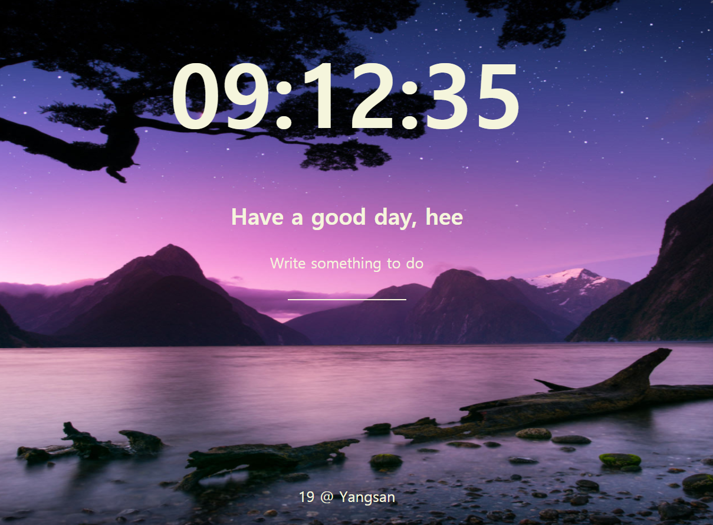

### 노마드 코더의 '바닐라 JS로 크롬 앱 만들기' 강의를 들으며 따라 만들었습니다.  

### 사용자를 등록하고, 할 일 목록을 생성할 수 있습니다.  

(메인 화면)  
</img>
  
### 알게된 내용
- 오픈 API 사용하기  
  -> 오픈 API란? 포털 사이트나 관공서 등의 정보 수집 단체에서 공공 이익을 위해 수집한 정보를 일정 수준에서 개방하는 서비스.

출처: https://ehclub.co.kr/2535 [언제나 휴일]
- API_KEY 숨기기 ([TIL구경하기](https://github.com/SeongheeJeon/TIL/blob/master/JavaScript/API_KEY%20%EC%88%A8%EA%B8%B0%EA%B8%B0.md))
- backtick(`) 사용  ([TIL구경하기](https://github.com/SeongheeJeon/TIL/blob/master/JavaScript/backtick(%60).md))
- Array.forEach()  
  -> 배열에 있는 각 요소에 대해 함수를 실행한다.

  ```jsx
  const array1 = ['a', 'b', 'c'];
  array1.forEach(element => console.log(element));

  /* 
  expected output
   > "a"
   > "b"
   > "c"
  */
  ```

- Array.filter()
  -> array의 모든 요소에 대해서 함수를 실행하고, 참값들만 새로운 배열로 반환한다.

- fn1.then(fn2)
  -> fn1에서 결과값 반환 받은 뒤 fn 실행.

---


## 백지코딩하며 다시 만들어본 개선된 Momentum2는 [여기](https://github.com/SeongheeJeon/Momentum2.git)서 확인하실 수 있습니다.
